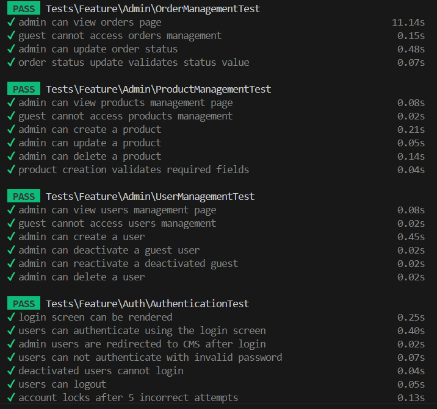
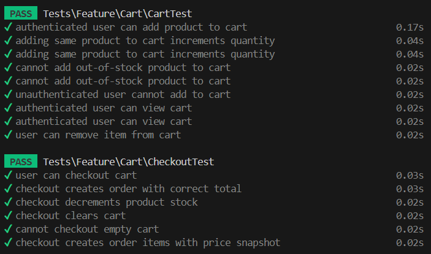

# PurpleBug Technical Assessment

Welcome to my submission for the PurpleBug full-stack web developer technical exam.

I built this modern e-commerce application to demonstrate my proficiency in building scalable web applications. The goal was to go beyond basic functionality and deliver a polished user experience with backend architecture, frontend rendering, and strict role-based access control as compliance with the examination requirements.

Thank you for taking the time to review my code.

## Technologies Used
- **Backend**: Laravel 11 (PHP 8.2+)
- **Frontend**: Vue.js 3 (Composition API) powered by Inertia.js
- **Styling**: Tailwind CSS v4 with custom dark/light mode theming & Shadcn-vue
- **Database**: MySQL via Laravel Eloquent ORM
- **Testing**: Pest PHP (Feature & Unit Testing)

## Features Implemented
- Strict Role-Based Access: Isolated routes and dashboards for Admin vs. Guest users.
- Authentication: Includes email verification for guests, rate limiting for failed logins (5 attempts / 5 minutes), and automatic session expiration after 30 minutes of inactivity.
- Admin CMS for User, Product, and Order management.
- Dynamic Cart System: Vue.js state management that seamlessly handles cart logic, quantity adjustments, and stock boundary validation.
- Activity Logging: Integrated tracking for transparent admin actions.
- Comprehensive Testing: A fully passing test suite validating transactions, form requests, and core restrictions.

## How to Run Locally

### Prerequisites
- PHP >= 8.2
- Node.js >= 20.x
- Composer
- Optional but recommended: Laravel Herd for isolated local hosting.

### Installation Steps

1. **Clone the Repository**
   ```bash
   git clone <repository-url>
   cd desembrana_loisjeffrey_exam
   ```

2. **Install Dependencies**
   ```bash
   composer install
   npm install
   ```

3. **Environment Setup**
   Copy the example environment file and generate your application key:
   ```bash
   cp .env.example .env
   php artisan key:generate
   ```
   (Note: Please configure your local database credentials in the .env file. To test guest registration without an SMTP server, ensure MAIL_MAILER=log is set so verification emails are written to storage/logs/laravel.log.)

4. **Run Migrations & Seeders**
   This will prepare your database schema and automatically inject the default Admin account and sample products.
   ```bash
   php artisan migrate:fresh --seed
   ```
5. **Link Storage**
   Crucial for ensuring the uploaded product images and seeded assets are visible on the storefront:
   ```bash
   php artisan storage:link
   ```
6. **Start the Application**
   Run the Vite development server for the frontend layout:
   ```bash
   npm run dev
   ```
   If using Herd, the site is now available at `http://desembrana_loisjeffrey_exam.test`. Otherwise, serve via PHP artisan:
   ```bash
   php artisan serve
   ```
### Testing the Application
   Access Credentials: A pre-verified Admin account is generated during the database seeding process.
   - Role: Administrator
   - Email: admin@purplebug.com
   - Password: password
   
   (To test the Guest view, simply log out or browse the storefront without authenticating. You can register a new guest account to test the cart checkout and email verification flows).
### Running Tests
To verify the application's integrity, transaction flows, and security constraints, run the Pest testing suite:
```bash
php artisan test
```
### System Screenshots

Below is a walkthrough of the application's core flows and layout, reflecting what a new user experiences:

<details>
  <summary><b>1. Guest Experience</b></summary>
  <br/>
  
  **Landing Page (Site is available in Dark and Light Theme depending on the device's settings)**
  .png)

  .png)

  **Add to Cart (Guest Warning)**
  .png)
</details>

<details>
  <summary><b>2. Authentication Flow</b></summary>
  <br/>

  **Registration Page**
  

  **Email Verification Requirement for new Users**
  

  **Verification Email Output**
  

  **System Log (SMTP testing)**
  

  **Login Page**
  
</details>

<details>
  <summary><b>3. Authenticated User flow</b></summary>
  <br/>

  **Active Cart & Checkout**
  

  **Thank You / Order Confirmation**
  

**Empty Cart**
  
  **User Order History**
  
</details>

<details>
  <summary><b>4. Admin CMS Portal</b></summary>
  <br/>

  **Admin Dashboard**
  

  **Product Management**
  

  **Order Management**
  

  **User Management**
  

  **Activity Logs**
  
</details>

<details>
  <summary><b>5. Testing Suites</b></summary>
  <br/>

  **Core Transaction Tests**
  

  **Cart Validation Tests**
  

  **Authentication & Email Tests**
  
</details>
